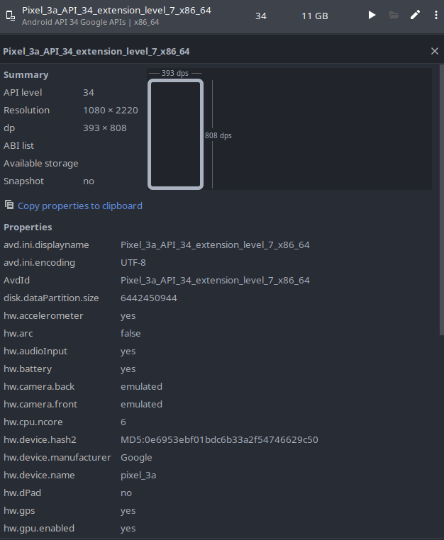
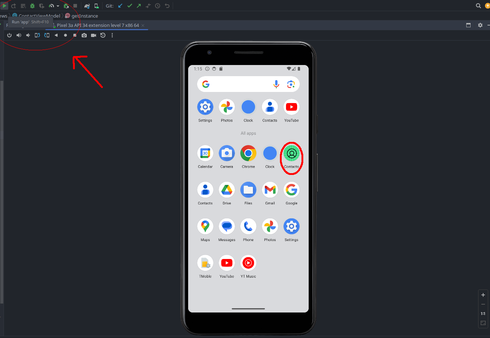

# Aplicativo de Contatos

## Descrição

Este projeto consiste em um backend Spring Boot e um aplicativo Android desenvolvido em Java usando o Android Studio. Este README fornece instruções sobre como configurar e executar ambos os aplicativos juntos para fins de avaliação.

## Pré-requisitos

- Java instalado em sua máquina.
- PostgreSQL instalado e rodando em sua máquina
- Gradle para construir a aplicação Spring Boot e Android.
- Android Studio instalado para a execução do aplicativo Android.

## ATENÇÃO

- No arquivo `server_api_contacts/src/main/resources/application.properties`
estão as informações sobre o banco de dados que será utilizado.
- Para rodar a aplicação, é necessário que o usuário tenha uma instância do banco rodando e que as credenciais estejam de acordo com os valores definidos em sua máquina (i.e. `username`, `password` e `url`)
- Além disso, será possível notar que há um atributo com o nome `spring.jpa.hibernate.ddl-auto`. Ele é responsável por controlar o comportamento da geração do esquema de dados ou sua modificação.
- Por padrão, ele está atribuído em `create`. Porém, isto só é válido para a primeira execução do spring boot. Após a primeira execução, é *NECESSÁRIO* a troca dele para `none`.
- O motivo disto é que, após a primeira execução, não há mais a necessidade de criar o banco. Caso a troca não seja feita, o banco será recriado toda vez que o spring boot for executado e não será possível manter a persistência por outras rodadas.

## Configuração do Backend (Spring Boot)

1. **Executar a Aplicação Spring Boot:**
   - Abra uma janela de terminal ou prompt de comando.
   - Navegue até o diretório que contém o script Spring Boot (i.e. este mesmo) (`run_spring_boot.sh`).
   - Execute o script digitando `./run_spring_boot.sh` no terminal.

   
   *Figura 1: Executando o script do Spring Boot*

## Configuração do Frontend (Aplicativo Android)

1. **Abrir o Android Studio:**
   - Inicie o Android Studio em seu computador.

2. **Abra o seu projeto Android:**
   - Use `File > Open` para navegar até o diretório do seu projeto Android e selecione-o.

3. **Configurar Emulador ou Conectar um Dispositivo (Emulador Recomendado):**
   - Abra o AVD Manager no Android Studio.
   - Crie um novo dispositivo virtual com a configuração do Pixel 3a (API 34, arquitetura x86_64).

   
   
   *Figura 2: Configuração do Emulador no AVD Manager*

4. **Executar o Aplicativo Android no Android Studio:**
   - Clique no botão verde de reprodução (Run) na barra de ferramentas ou vá para `Run > Run 'app'`.
   - Escolha o emulador Pixel_3a_API_34_extension_level_7_x86_64 para testes.

   
   *Figura 3: Executando o Aplicativo no Emulador*

## Funcionalidades

- Segue o arquivo documentado as funcionalidades do sistema: 
